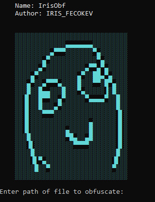

# IrisObf

[](https://www.python.org/)


[](https://opensource.org/licenses/MIT)

> A lightweight yet sophisticated Python obfuscator to secure your code.

## Review
<p align="left">
  
</p>

## Peculiarities

* Fast and efficient Python script obfuscation.

* Protection against direct reading and copying of source code.

* Ease of use: one command and your code is obfuscated.

* The obfuscator is completely stable.

* Does not rely on a specific Python version.

* Supports Mac, Windows, and Termux.

## Quick start

1. Clone the repository:
    ```bash
    git clone https://github.com/iris-fecokev/IrisObf.git
    cd IrisObf
2. Launch IrisObf:
    ```bash
    python IrisObf.py
3. And obfuscate your file!
